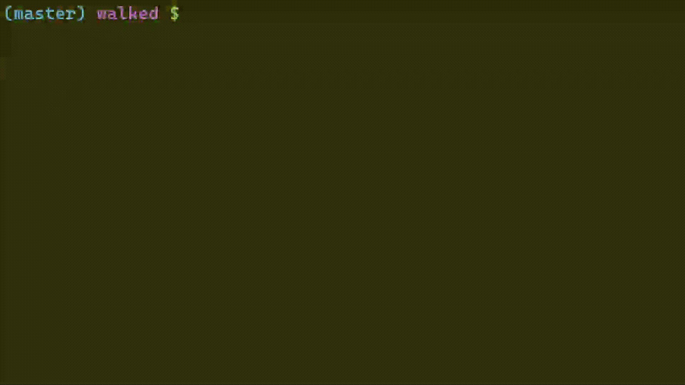

# walkEd
Simple terminal file manager



# Features
`walkEd` can:
 - Navigate through the filesystem
 - Duplicate, copy and paste files/directories,
 - Create, remove and rename files/directories.
 - Select multiple entries and do the operations mentioned above in bulk (except renaming, for now)
 - Split the view into multiple panes for editing multiple directories at the same time
 - Do incremental search

Work in progress/planned features:
 - Fuzzy search
 - Exhaustive support for symlinks

# Build Instructions
```console
  $ git clone https://github.com/serd223/walked.git
  $ cd walked
  $ cargo install --path .
```

For you to be able to change your directory upon quitting `walkEd`, you will need to add something along the lines of the following script to your autoexec script (.bashrc, Powershell_profile.ps1, etc):
```powershell
# Example Powershell profile
function wd() {
  cd $(walked.exe)
}
```

Now, you can use the `wd` command to use `walkEd` and change your working directory with it.


# Configuration
`walkEd` uses a simple `TOML` file for configuration. You can optionally supply the path to your configuration file as a command line argument to the program. (This would typically be done in your autoexec script mentioned above)
## Example
```console
  $ walked myconf.toml # uses default configuration if myconf.toml couldn't be found
```
## Writing your configuration file
For a complete list of configurable options, see `Config` in [config.rs](https://github.com/serd223/walked/blob/master/src/config.rs).

If an option isn't specified inside your configuration file, the default value will be used.

Boolean and string options can be written like normal. For example:
```toml
# my_conf.toml
normal_mode_text = "NORM"
show_entry_number = false
```
Keybindings can be described with a very simple string format like this:
```toml
new_file = "C-N" # Control + N, typing a lowercase 'n' wouldn't work in this case
quit = "cA-Esc" # Control + Alt + Escape
# Both control and alt modifiers can be uppercase or lowercase, so this would be valid too:
# quit = "Ca-Esc" # Control + Alt + Escape
# or this:
# quit = "ca-Esc" # Control + Alt + Escape
# and so on

# Space can be written as-is
dir_walk = " "
# It can be used with any modifier just like other characters
dir_up = "S- " # Shift + Space

# Note that Control + Shift style bindings like this:
copy = "CS-c" # Control + Shift + C
# Only work on Windows due to the Console API there. On any other systems using standard
# terminal protocols, terminals can't distinguish between Control and Control + Shift modifiers.

# Please note that characters that have uppercase/lowercase variants may not work properly with the
# shift modifier as the shift key is commonly used to reverse the capitalization of the typed letter

# Here is the list of supported 'special' keys: (these are case sensitive, so you can't write "up" in your config)
# Backspace
# Enter
# Left
# Right
# Up
# Down
# Home
# End
# PageUp
# PageDown
# Tab
# BackTab
# Delete
# Insert
# Esc
# Function keys can be written normally (F6, F9, F11, etc)

```

## Default Keybindings
`new_file`: C-n

`new_directory`: C-b

`duplicate`: C-d

`remove`: C-x

`copy`: C-y

`paste`: C-p

`incremental_search`: /

`next_search_result`: n

`prev_search_result`: N

`up`: k

`select_up`: K

`pane_up`: C-k

`split_pane_up`: A-k

`down`: j

`select_down`: J

`pane_down`: C-j

`split_pane_down`: A-j

`left`: h

`pane_left`: C-h

`split_pane_left`: A-h

`right`: l

`pane_right`: C-l

`split_pane_right`: A-l

`insert_mode`: i

`normal_mode`: `Esc`

`close_active_pane`: C-q

`quit`: q

`dir_walk`: `Space`

`dir_up`: x
